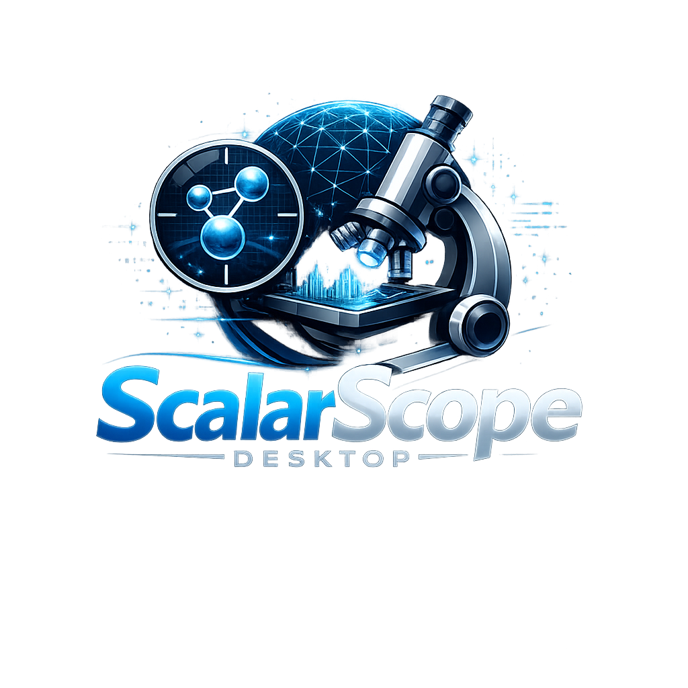

<p align="center">
  <a href="README.md">English</a> | <a href="README.ja.md">日本語</a> | <a href="README.zh.md">中文</a> | <a href="README.es.md">Español</a> | <a href="README.fr.md">Français</a> | <a href="README.hi.md">हिन्दी</a> | <a href="README.it.md">Italiano</a> | <a href="README.pt-BR.md">Português (BR)</a>
</p>

<p align="center">
  
</p>

# ScalarScope-Desktop

> [MCP Tool Shop](https://mcptoolshop.com) の一部

<p align="center">
  <a href="https://github.com/mcp-tool-shop-org/ScalarScope-Desktop/actions/workflows/build.yml"></a>
  <a href="LICENSE"></a>
  <a href="https://mcp-tool-shop-org.github.io/ScalarScope-Desktop/"></a>
  <a href="https://apps.microsoft.com/detail/9P3HT1PHBKQK"></a>
  <a href="https://www.nuget.org/packages/VortexKit"></a>
</p>

**ASPIRE Scalar Vortex Visualizer** — 機械学習推論の実行結果を科学的な厳密さで比較するための、.NET MAUIデスクトップアプリケーションです。

---

## ScalarScopeを使う理由

多くの機械学習チームでは、ログを目視で確認しています。ScalarScopeは、構造化された再現可能な比較によって、そのプロセスを置き換えます。

- **同一条件での比較** — 2つの推論結果を並べて表示し、何が変更されたかを正確に把握できます。
- **標準的なデルタ分析** — 統計的に意味のある差異のみを検出する5種類のデルタ（ΔTc、ΔO、ΔF、ΔĀ、ΔTd）を提供します。
- **実行時プリセット** — TFRTプリセットでは、TensorFlow-TRTのワークロードにとって無関係なメトリクスを自動的に抑制し、重要な要素に集中できます。
- **再現可能なバンドル** — SHA-256による整合性チェック、固定されたデルタ、および完全なメタデータを含む`.scbundle`アーカイブをエクスポートできます。
- **レビューモード** — 再計算せずにバンドルを開き、結果は暗号学的に検証され、再計算されることはありません。
- **プライバシー重視** — テレメトリーや分析は一切行わず、すべてのデータは明示的にエクスポートしない限りローカルに保持されます。

---

## NuGetパッケージ

| パッケージ | バージョン | 説明 |
| --------- | --------- | ------------- |
| [VortexKit](https://www.nuget.org/packages/VortexKit) | [](https://www.nuget.org/packages/VortexKit) | トレーニングの動態を可視化するための再利用可能なフレームワーク。タイムシンクロナイズされた再生、アニメーションSkiaSharpキャンバス、比較ビュー、注釈オーバーレイ、SVG/PNGエクスポート、およびセマンティックカラーシステムを提供します。SkiaSharp + MAUIを基盤として構築されています。 |

```bash
dotnet add package VortexKit
```

---

## クイックスタート

### Microsoft Storeから

1. [Microsoft Store](https://apps.microsoft.com/detail/9P3HT1PHBKQK)から**ScalarScope**をインストールします（ストアID: `9P3HT1PHBKQK`）。
2. **2つの実行結果を比較**をクリックします。
3. 最適化前のTFRTのベースラインをロードします。
4. 最適化後のTFRTをロードします。
5. **比較**タブでデルタを確認します。
6. 再現可能な共有のために`.scbundle`をエクスポートします。

### VortexKitを独自のアプリケーションで使用する

```csharp
using VortexKit.Core;

// 1. Create a shared playback controller (0.0 -> 1.0 timeline)
var player = new PlaybackController { Duration = 10.0, Loop = true };

// 2. Bind multiple animated canvases to the same controller
player.TimeChanged += () =>
{
    trajectoryCanvas.CurrentTime = player.Time;
    eigenCanvas.CurrentTime      = player.Time;
    scalarsCanvas.CurrentTime    = player.Time;
};

// 3. Subclass AnimatedCanvas for custom rendering
public class MyTrajectoryCanvas : AnimatedCanvas
{
    protected override void OnRender(SKCanvas canvas, SKImageInfo info, double time)
    {
        // Your SkiaSharp rendering at the current time position
    }
}

// 4. Export a side-by-side comparison as PNG
var exporter = new ExportService();
await exporter.ExportComparisonAsync(
    leftRender, rightRender, time: 0.5,
    outputPath: "comparison.png",
    new ComparisonExportOptions
    {
        Width = 1920, Height = 1080,
        LeftLabel = "Baseline", RightLabel = "Optimized",
        ShowLabels = true
    });

// 5. Export as layered SVG (Inkscape-compatible)
var svgExporter = new SvgExportService();
await svgExporter.ExportSvgAsync(svgData, "trajectory.svg",
    new SvgExportOptions
    {
        Palette = SvgColorPalette.Publication,
        UseCatmullRomSplines = true,
        EnableGlow = false
    });
```

---

## 機能

### デルタ分析 — 5つの標準デルタ

比較ごとに、一連の標準デルタが生成されます。各デルタは、差異が統計的に意味のある場合にのみ有効になり、無関係なデルタは自動的に抑制されます。

| Delta | 完全名称 | 測定内容 | 有効になるタイミング |
| ------- | ----------- | ------------------ | ------------ |
| **ΔTc** | 収束時間 | 安定したレイテンシに到達するまでのステップ数 | 異なるステップ数で安定状態に到達（≥3ステップの分離） |
| **ΔO** | 出力変動 | 発振/実行時不安定性 | 閾値以上のスコアの面積がノイズレベルを超えている |
| **ΔF** | エラー率 | 異常頻度 | 実行間のエラー頻度または種類が異なる |
| **ΔĀ** | 平均レイテンシ | 平均メトリクス値 | 平均値が有意に異なる（TFRTプリセットでは抑制されます） |
| **ΔTd** | 合計時間 | 経過時間/構造的出現 | 時間または支配の開始が異なる（TFRTプリセットでは抑制されます） |

### 実行時プリセット — TFRT

組み込みの**TensorFlow-TRT**プリセット（`tensorflowrt-runtime-v1`）は、推論固有の信号（レイテンシ、スループット、メモリ、CPU/GPU負荷）をマッピングし、トレーニングのみに関連するデルタ（ΔĀ、ΔTd）を抑制します。ウォームアップが実行時間の50%を超える場合、または利用可能な統計が合計値のみの場合に、警告が表示されます。

### 再現可能なバンドル

結果を`.scbundle`アーカイブ（ComparisonBundle v1.0.0）としてエクスポートします。

- **`manifest.json`** — バンドルのメタデータ、アプリのバージョン、比較ラベル、アライメントモード
- **`repro/repro.json`** — 入力データ、プリセットハッシュ、決定性シード、環境情報
- **`findings/deltas.json`** — 信頼度スコア、アンカー、トリガータイプを含む、標準的なデルタ
- **`findings/why.json`** — 人間が読める説明、ガードレール、パラメータチップ
- **`findings/summary.md`** — 自動生成されたMarkdown形式のサマリー
- **Integrity (完全性)** — すべてのファイルがSHA-256でハッシュ化。バンドルレベルのハッシュにより、改ざんを検出

### レビューモード

`.scbundle`ファイルを再計算せずに開きます。レビューモードでは、完全性が検証され、固定されたデルタが表示され、結果が検証されていることを示すバナーが表示されます（再計算されたものではありません）。

### VortexKit 可視化フレームワーク

VortexKitは、抽出された可視化エンジンであり、スタンドアロンのNuGetパッケージとして公開されています。

| コンポーネント | 機能 |
| ----------- | ------------- |
| `PlaybackController` | 再生/一時停止/ステップ/ループ機能を持つ、共有の0→1のタイムライン。速度プリセット（0.25倍速〜4倍速）、約60fpsのティック。 |
| `AnimatedCanvas` | 時間同期された無効化、グリッド描画、タッチ/ドラッグイベント、座標ヘルパーを備えた、抽象クラス`SKCanvasView`。 |
| `ITimeSeries<T>` / `TimeSeries<T>` | インデックスと時間のマッピング、およびトレイルの列挙を行う、ジェネリックな時系列データ。 |
| `ExportService` | 単一フレームのPNG、フレームシーケンス（ffmpegのヒント付き）、および並列比較のエクスポート。 |
| `SvgExportService` | Inkscapeのレイヤー、Catmull-Romスプライン、ヒートマップ、ベクトルフィールド、および4つのカラーパレット（デフォルト、ライト、高コントラスト、出版用）を備えた、フルベクターSVGのエクスポート。 |
| `IAnnotation` | 理論的根拠と優先順位を持つ、型付きのアノテーション（フェーズ、警告、洞察、失敗、カスタム）。 |
| `VortexColors` | セマンティックカラーパレット — 背景レイヤー、アクセントセマンティクス、重大度コーディング、固有値パレット、およびLerp/グラデーションヘルパー。 |

---

## インストール

### Microsoft Store（推奨）

**ストアID:** `9P3HT1PHBKQK`

[Microsoft Storeから入手](https://apps.microsoft.com/detail/9P3HT1PHBKQK)

Windows 10（ビルド17763）以降が必要です。

### ソースコードから

```bash
# Prerequisites:
#   .NET 9.0 SDK (global.json pins 9.0.100)
#   Visual Studio 2022 with MAUI workload, or:
#     dotnet workload install maui-windows

git clone https://github.com/mcp-tool-shop-org/ScalarScope-Desktop.git
cd ScalarScope-Desktop
dotnet restore
dotnet build

# Run the desktop app
dotnet run --project src/ScalarScope
```

### NuGet（ライブラリのみ）

```bash
dotnet add package VortexKit
```

---

## プロジェクト構造

```
ScalarScope-Desktop/
├── src/
│   ├── ScalarScope/                    # .NET MAUI desktop app
│   │   ├── Models/                     # GeometryRun, InsightEvent
│   │   ├── ViewModels/                 # Welcome, Comparison, Export, Settings, TrajectoryPlayer, VortexSession
│   │   ├── Views/                      # XAML pages + 30+ custom controls
│   │   │   ├── WelcomePage.xaml        # First-60-seconds onboarding
│   │   │   ├── ComparisonPage.xaml     # Side-by-side delta comparison
│   │   │   ├── TrajectoryPage.xaml     # Animated trajectory playback
│   │   │   ├── GeometryPage.xaml       # Eigenvalue spectrum view
│   │   │   └── Controls/              # DeltaZone, BundleExportPanel, PlaybackControl, etc.
│   │   ├── Services/
│   │   │   ├── Connectors/            # RunTraceComparer, TfrtRuntimePreset, validation
│   │   │   ├── Bundles/               # BundleBuilder, BundleExporter, integrity, schemas
│   │   │   ├── Evidence/              # Comparison evidence reports, detector diagnostics
│   │   │   ├── Plugins/               # PluginManager
│   │   │   ├── CanonicalDeltaService.cs
│   │   │   ├── DeltaTypes.cs          # 5 canonical deltas + detector configs
│   │   │   ├── DeterminismService.cs  # Reproducible seed management
│   │   │   ├── FlowFieldService.cs    # Vector field computation
│   │   │   └── ...                    # 40+ service files
│   │   └── Resources/
│   │       ├── Styles/DesignSystem.xaml # Unified visual grammar
│   │       └── Raw/Samples/            # Built-in example traces
│   │
│   └── VortexKit/                      # Standalone NuGet library
│       ├── Core/
│       │   ├── AnimatedCanvas.cs       # Time-synced SkiaSharp canvas base
│       │   ├── PlaybackController.cs   # Shared playback timeline
│       │   ├── ITimeSeries.cs          # Generic time-series interface
│       │   ├── ExportService.cs        # PNG frame/sequence export
│       │   └── SvgExportService.cs     # Layered SVG export
│       ├── Annotations/
│       │   └── IAnnotation.cs          # Typed annotation system
│       └── Theme/
│           └── VortexColors.cs         # Semantic color palette
│
├── tests/
│   ├── ScalarScope.FixtureTests/       # Golden-file fixture tests
│   ├── ScalarScope.DeterminismTests/   # Reproducibility verification
│   ├── ScalarScope.SoakTests/          # Long-running stability tests
│   └── Fixtures/                       # Shared test data
│
├── docs/                               # Design docs, results, limitations
├── .github/workflows/
│   ├── build.yml                       # CI: restore, build, format check, pack, artifacts
│   ├── publish.yml                     # NuGet publish
│   └── release.yml                     # GitHub Release + Store submission
├── global.json                         # .NET SDK 9.0.100
├── ScalarScope.sln                     # Solution file
├── CHANGELOG.md                        # Keep-a-Changelog format
├── PRIVACY.md                          # Privacy policy (no telemetry)
├── SECURITY.md                         # Security policy
└── STORE_LISTING.md                    # Microsoft Store listing copy
```

---

## テスト

```bash
# Run all tests
dotnet test

# Fixture smoke tests only
dotnet test --filter Category=FixtureSmoke

# Determinism tests (verifies reproducible deltas)
dotnet test --filter Category=Determinism

# With coverage
dotnet test --collect:"XPlat Code Coverage"
```

---

## 関連

- [ScalarScope (Python)](https://github.com/mcp-tool-shop-org/ScalarScope) — コアのトレーニングフレームワーク
- [RESULTS_AND_LIMITATIONS.md](docs/RESULTS_AND_LIMITATIONS.md) — 実験結果の詳細
- [CHANGELOG.md](CHANGELOG.md) — リリース履歴
- [PRIVACY.md](PRIVACY.md) — プライバシーポリシー
- [ROADMAP.md](ROADMAP.md) — 予定されている機能

---

## ライセンス

[MIT](LICENSE) — Copyright (c) 2025-2026 ScalarScope Project (mcp-tool-shop-org)
